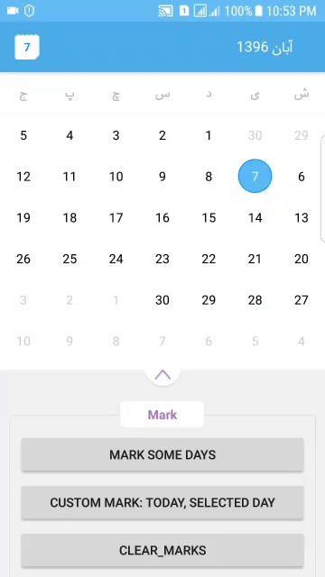
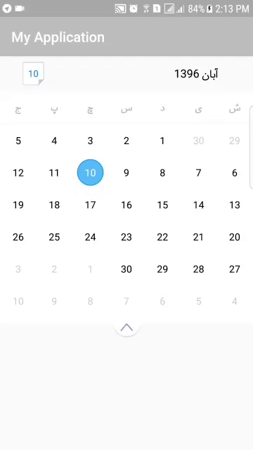
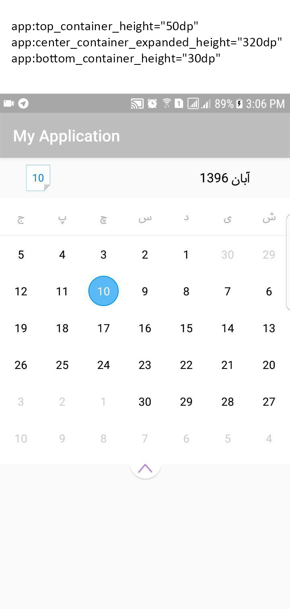
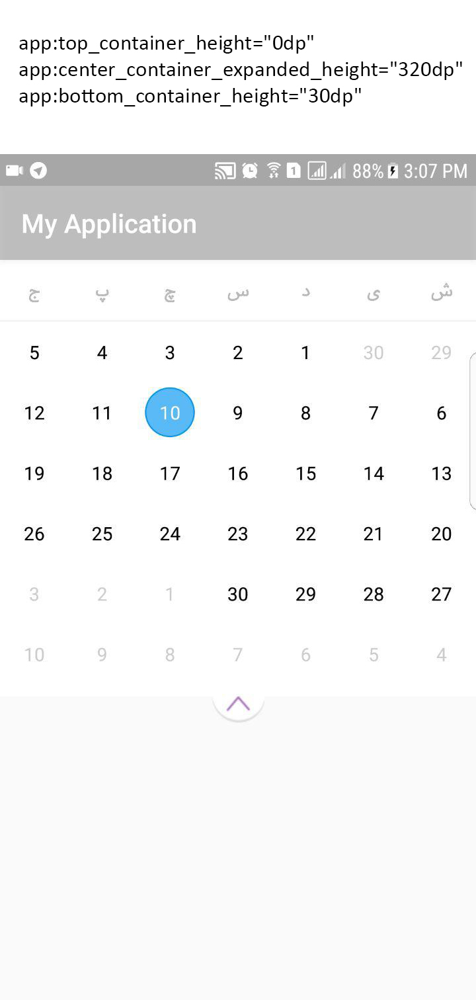
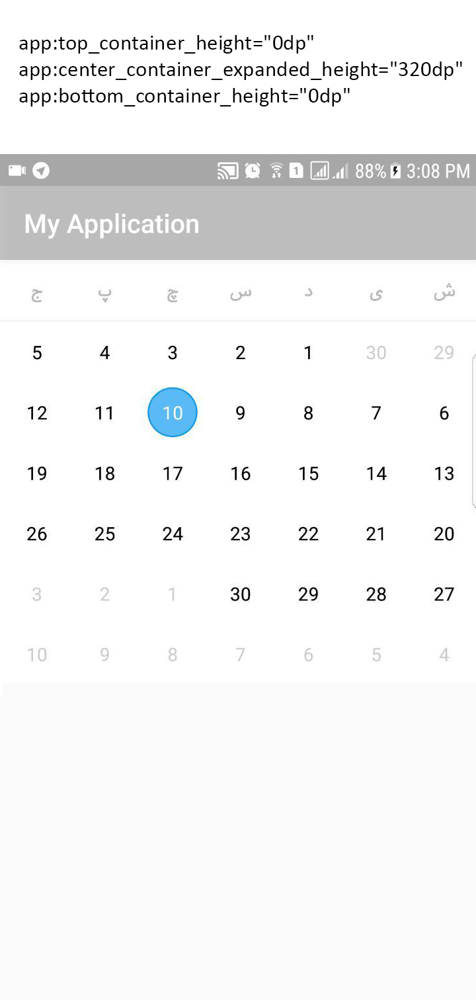

# PersianHorizontalExpCalendar

This library offers a customizable and expandable horizontal Persian calendar widget for Android 4.1 (Jelly Bean) (API 16) +.

## Screenshots


## Usage

### Download

1) Add JitPack repository in your root `build.gradle` at the end of `repositories` :

```java

allprojects {
  repositories {
      ...
      maven { url 'https://jitpack.io' }
  }
}

```
 
2) Add dependency to your root `build.gradle` :

```java
dependencies {
  ...
  compile 'com.github.mohamadian:PersianHorizontalExpCalendar:1.4.2'
}
```

### Call JodaTimeAndroid.init()
You must initialize the library before using it by calling `JodaTimeAndroid.init()`. I suggest putting this code in `Application.onCreate()` :

```java
public class MyApplication extends Application {
    @Override
    public void onCreate() {
        super.onCreate();
        JodaTimeAndroid.init(this);
    }
}
```

and use `MyApplication` class in `AndroidManifest.xml` like this:
```java
<manifest xmlns:android="http://schemas.android.com/apk/res/android"
    package="com.mohamadian.testapp">

    <application
        android:name=".MyApplication"
        android:allowBackup="true"
        android:icon="@mipmap/ic_launcher"
        android:label="@string/app_name"
        android:roundIcon="@mipmap/ic_launcher_round"
        android:supportsRtl="true"
        android:theme="@style/AppTheme">
        <activity android:name=".MainActivity">
            <intent-filter>
                <action android:name="android.intent.action.MAIN" />
                <category android:name="android.intent.category.LAUNCHER" />
            </intent-filter>
        </activity>
    </application>
</manifest>
```

### Add to Layout
To use PersianHorizontalExpCalendar, you need to add it in layout by using xml file.

```java
  <com.mohamadian.persianhorizontalexpcalendar.PersianHorizontalExpCalendar
      android:id="@+id/persianCalendar"
      android:layout_width="match_parent"
      android:layout_height="wrap_content"
      android:layout_alignParentLeft="true"
      android:layout_alignParentStart="true"
      android:layout_alignParentTop="true"
      app:initial_view="Week"
      app:mark_today="true"
      app:mark_selected_day="true"
      app:use_RTL_direction="true"
      app:range_months_before_init="12"
      app:range_months_after_init="12"
      app:top_container_height="0dp"
      app:center_container_expanded_height="320dp"
      app:bottom_container_height="30dp"/>
```

`app:initial_view="Week"`: Set default view to `week` view. If you want to set default view to `month` view use this `app:initial_view="Month"`

`app:use_RTL_direction="true"`: Set direction of calendar. 

LTR Direction | RLT Direction
---- | ----
 | 

`app:range_months_before_init="12"` , `app:range_months_after_init="12"`: Set range in months before and after INIT_DATE (today), values in Integer.

```java
      app:top_container_height="50dp"
      app:center_container_expanded_height="320dp"
      app:bottom_container_height="30dp"
```
You can define size of calendar containers (top, center and bottom container):

LTR Direction | RLT Direction | RLT Direction
---- | ---- | ----
 |  | 


### ...

### Credits 
This libary is based on [HorizontalExpandableCalendar-Android](https://github.com/sulo61/HorizontalExpandableCalendar-Android) and [PersianJodaTime](https://github.com/mohamadian/PersianJodaTime).

### Thanks
Special thanks to [MikeSu](https://github.com/sulo61) and [zubinkavarana](https://github.com/zubinkavarana).
